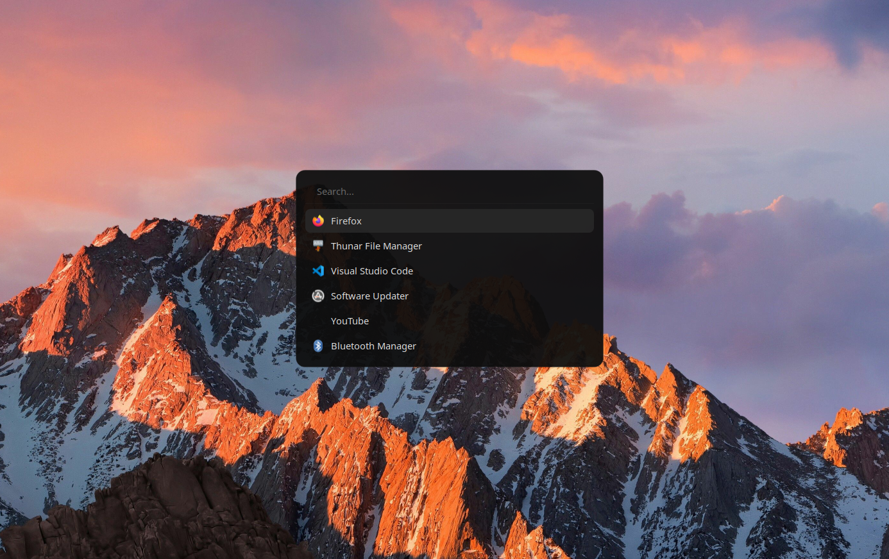

# rofi-config

A minimal, dark, transparent rofi launcher theme.



## Features
- App launcher + run mode (`drun`, `run`)
- Fully transparent background with subtle border
- Rounded corners, centered floating window
- No scrollbar, clean single-column list

## Dependencies
- [rofi](https://github.com/davatorium/rofi) (tested on X.X)
- `JetBrainsMono Nerd Font`
- `Papirus-Dark` icon theme

## Install
```bash
git clone <your-repo-url>
cp rofi-config/config.rasi ~/.config/rofi/config.rasi
```

## Usage
```bash
rofi -show drun
```

## Customize
Colors are defined at the top of the file as global variables (`bg`, `fg`, `accent`, etc.) — change those to retheme quickly.
